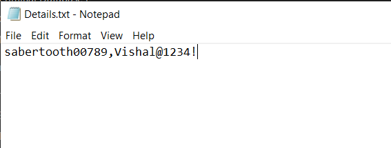

# Criminal Database Management using C++
A Backend of Database system from scratch.
# Link : 
https://drive.google.com/drive/folders/1CxJe6yH3AxtJuRxvDQ1l4ZCwsMHsqTpc?usp=sharing

* Link contains project.
* Screenshots

# Screenshot : 

# Criminal Database Management using C++
* A database management aimed to provide a basic support to its user by providing features of adding and removing informations of criminals.

# Information
* This is made entirely with Linked list data structure with a very less touch of file handling.
* It uses a linked list to store and retrieve user information as well as can be used to delete a profile.
* 
# System Requirements
* Windows 10 pro
* Visual Studios 17 or above
* Core i5 processors 7th gen or above.
* Notepad or Notepad++

# Getting Started
* Start by downloading the project from given link at the top.
* Visual Studio 2019 or 2019 is recommended, It is made to run on Windows OS (8,10).
* Basics of C++ language.
* Basic Knowledge of File handling

# Main features to come:
* A good frontend.
